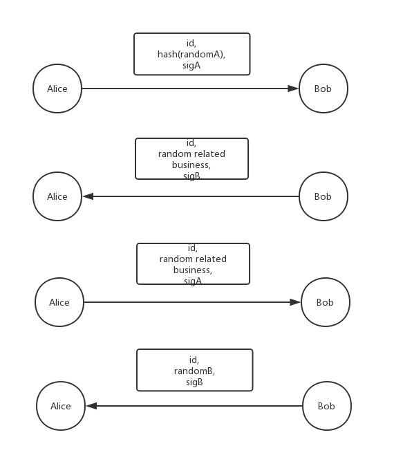

# stateChannel-diceGame contract (WIP) 

Contracts of state channel, support payment and dice game:

- payment: transfer value off-chain using secure, efficient and low-cost channel
- dice game: dApp based on state channel, including a off-chain random generation algorithm

## Payment

Simplified process: 

1. open channel on-chain
2. send balance proof off-chain
3. close channel

## Dice game 

Off-chain random generation algorithm:

Random = hash(randomA, randomB)

