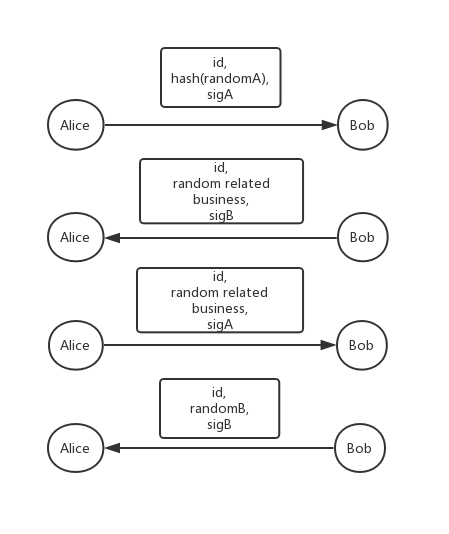

# State-Channel SDK of Ethereum 


The sdk is a contract framework for building state-channel application. Using these components and primitives, a decentralized application can be built with high performance without losing the trustless core of blockchain system.

## State-Channel Contract

### Interface

```solidity
// Open a channel of peer1 and peer2, peer1 deposit at the same time
function openChannel(address peer1, address peer2, uint256 settleWindow );

// Deposit token into channel
function depositChannel(bytes32 id, address peer);

// Cooperative settle channel
function cSettleChannel(address payable peer1, uint balance1, address payable peer2, uint balance2, bytes memory sig1, bytes memory sig2);

// Force close channel, while disputing in off-chain status
function fCloseChannel(address partner, bytes32 balanceHash, uint nonce, bytes memory pSig);

// Commit off-chain proof to blockchain for arbitration
function partnerCommitProof(address partner, address closer, bytes32 balanceHash, uint nonce, bytes memory cSig, bytes memory pSig);

// Settle channel to get current token, the remaining token waiting for arbitration
function fSettleChannel(bytes memory data);

// Unlock would call application to get arbitration result, then distribute token
function unlock(bytes32 lockID, address payable peer1, address payable peer2);
```

## Application Interface
State-Channel contract using the interface to interact with application, that is to say, your decentralized application should implement this to acquire trustless ability.

For now, there is just `getResult` method, which gets arbitration result from your application.

```solidity
/**
 * @param lockID generated in step fSettleChannel
 * @param pee1 participant in the state-channel
 * @param pee2 the other participant in the state-channel
 * @return status arbitrate status in application
 * @return balance1 distribute value of peer1
 * @return balance2 distribute value of peer2
 */
interface AppInterface {
    function getResult(bytes32 lockID, address peer1, address peer2) external returns(uint status, uint balance1, uint balance2);
}
```

## Demo
A dice game supports mainstream gaming: flip-coin、dice、two-dice、etheroll, which including a off-chain random generation algorithm:



Random = hash(randomA, randomB)

## Two simple test

### Transfer value off-chain:
 1. Peer1 Open channel with peer2
 2. Peer1 transfer value to peer2 off-chain
 3. Peer2 deposit value in channel
 4. Peer2 transfer value to peer1 off-chain
 5. Arbitration on-channel, peer1 force close channel
 6. Peer2 commit proof on-chain
 7. waiting settle window over
 8. settle channel on-chain

<pre>
truffle test test/transfer.js
</pre>

 ### Play dice game off-chain
 1. Peer1 open channel
 2. Peer2 deposit Channel
 3. Peer1 start a dice game off-chain, send game proof and random proof
 4. Peer2 send lock transfer(lock game stake) to accept game
 5. Peer1 send lock transfer(lock game stake) to peer2
 6. Peer2 send game proof and random proof
 7. Dispute when playing off-chain, peer2 go on-chain, force close channel 
 8. Peer2 commit random proof to random contract
 9. Peer2 commit game proof to game contract
 10. Peer1 commit balance proof to channel contract
 11. Peer1 commit pre-image to random contract
 12. Peer1 settle channel
 13. Peer1 unlock

<pre>
truffle test test/game.js
</pre>
